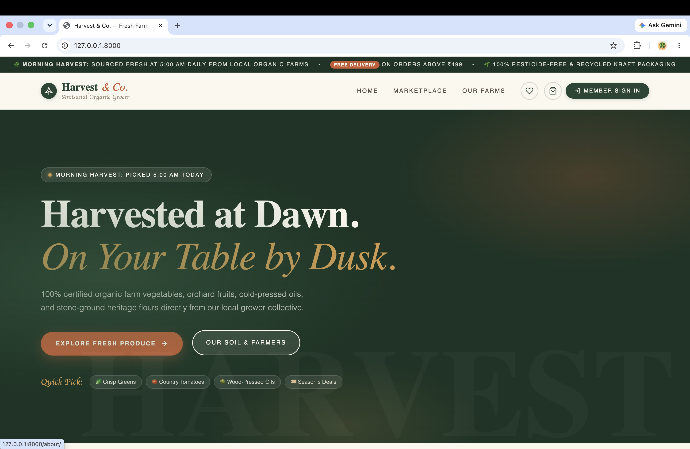
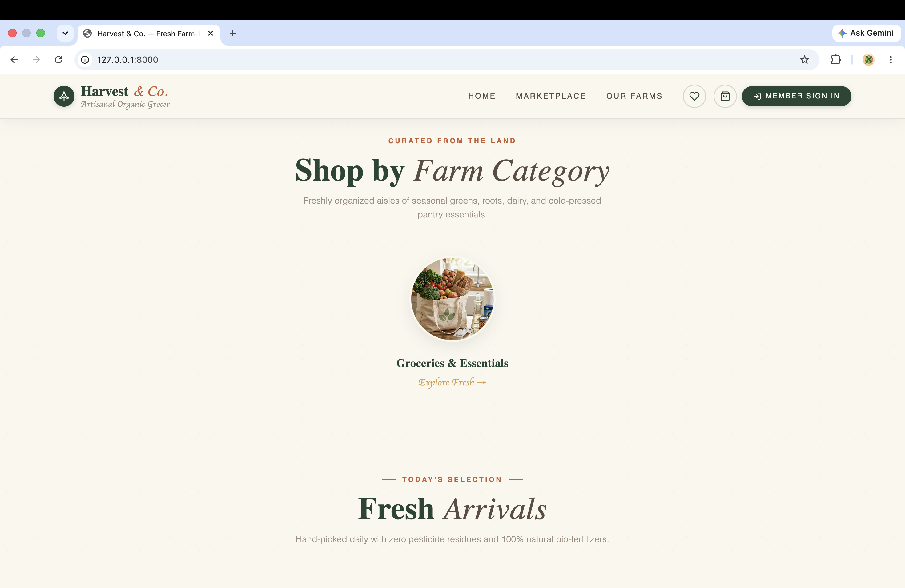
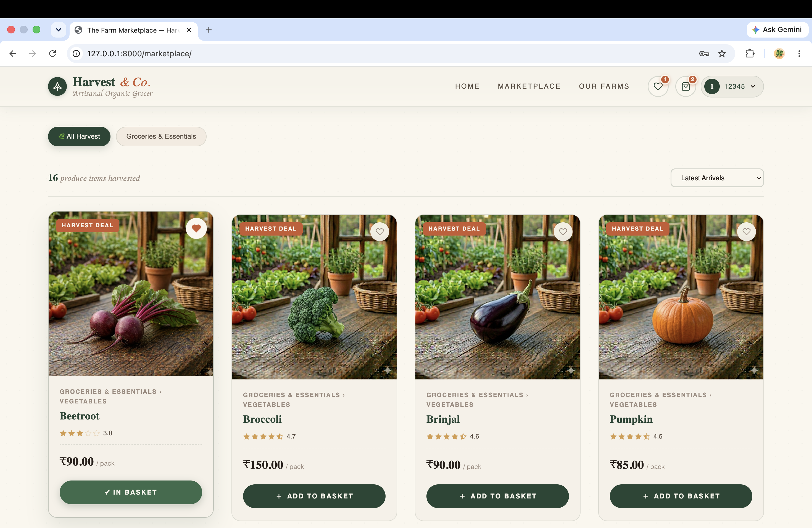
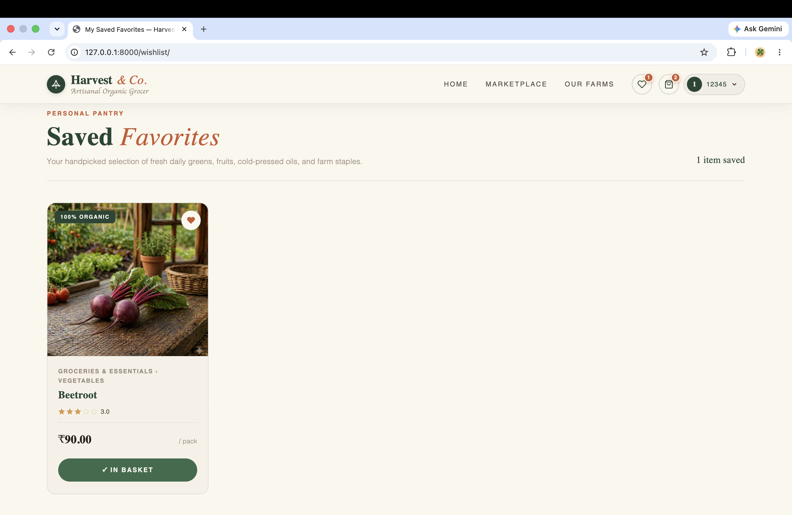
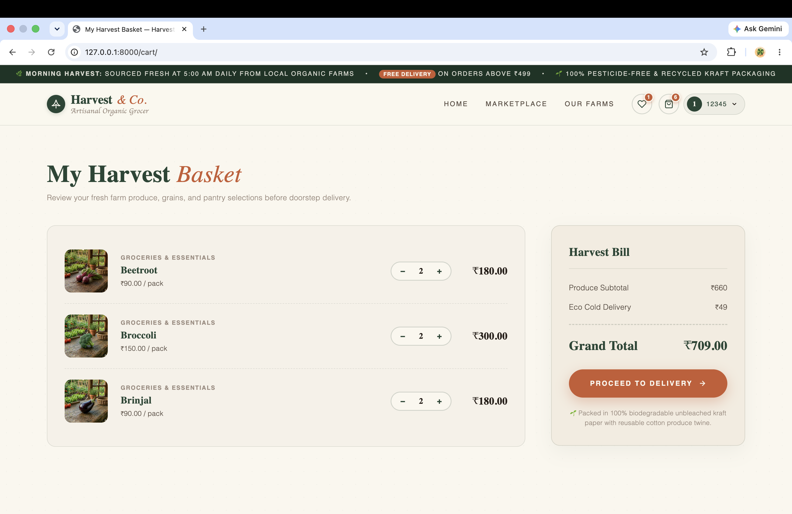
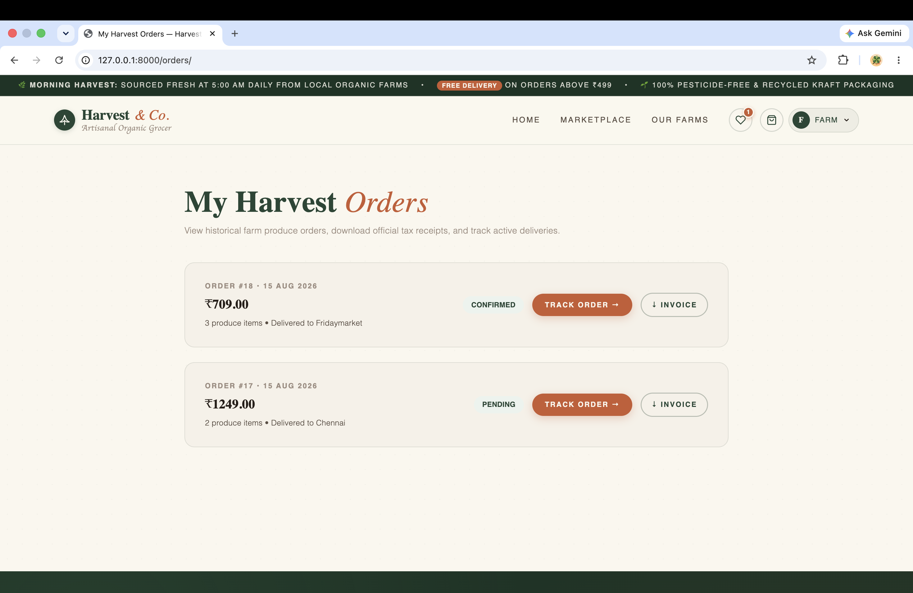
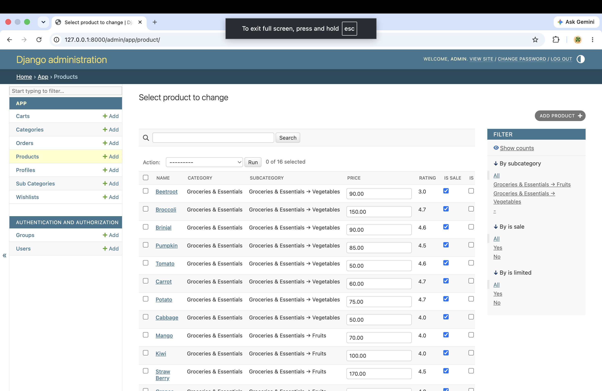

# 🌾 Harvest & Co.

**⚡ Scalable grocery commerce & inventory orchestration — built with Django.**

---

## 🎨 Interface & Feature Showcase

### 🖼️ Brand Landing Page

* **Visual Identity & Aesthetics**: Features a modern, clean aesthetic tuned with tailored brand colors to present a crisp, premium identity for modern organic produce shopping.
* **Hero Banner**: High-impact introduction highlighting sustainable sourcing, seasonal promotions, and immediate call-to-action triggers for quick navigation.

---

### 🥬 Product Catalog Overview

* **Dynamic Grid Layout**: Responsive item organization displaying real-time pricing, stock indicators, and crisp visual cards.
* **Smart Filtering & Navigation**: Instant filtering mechanisms allowing seamless switching between grocery categories, fresh produce, and pantry staples.

---

### 🔍 Detailed Item View

* **In-Depth Product Specs**: Highlights detailed descriptions, net weight/volume, inventory availability status, and pricing breakdowns.
* **Interactive Controls**: Direct controls for selecting quantities, adding items to active carts, or toggling favorites on the fly.

---

### ❤️ Saved Favorites

* **User Wishlist Hub**: Dedicated section enabling registered shoppers to bookmark items for future purchases.
* **Quick-Transfer Actions**: One-click functionality to migrate saved items straight into the active shopping cart when ready.

---

### 🛒 Real-Time Cart System

* **Dynamic Price Calculations**: Automatically updates sub-totals, delivery estimates, taxes, and grand totals upon item modifications.
* **Session & Database Persistence**: Maintains cart state across sessions for logged-in users to ensure zero loss of selected inventory.

---

### 📦 Order History & Tracking

* **Purchase Log**: Complete customer order tracking panel detailing past transactions, itemized receipts, and order timestamps.
* **Fulfillment Status**: Visual indicators showing current processing stages from order placement to final delivery.

---

### 🛠️ Django Admin Control Center

* **Backend Inventory Management**: Administrative interface for managing product catalog models, inventory levels, category schemas, and customer orders.
* **Data Integrity**: Powered by relational integrity rules to prevent stock over-subscriptions and manage user permissions efficiently.

---

## 🧩 Architecture Overview

* 🐍 **Backend Core**: Django 6.0 + Clean MVC Architecture
* 🔐 **Authentication**: Secure user session handling and role-based access control
* 📦 **Inventory Engine**: Real-time stock tracking with relational validation
* 🗄️ **Database Structure**: Relational SQLite / PostgreSQL setup built for fast catalog querying and transaction safety
* 🎨 **Frontend Stack**: Dynamic Django Templating integrated with responsive UI styling

---

## 🚀 Why This Project?

Built to handle the real-world complexities of modern retail platforms—dynamic pricing, perishable stock management, seamless cart operations, and administrative inventory control—all wrapped in a clean, high-performance architecture.